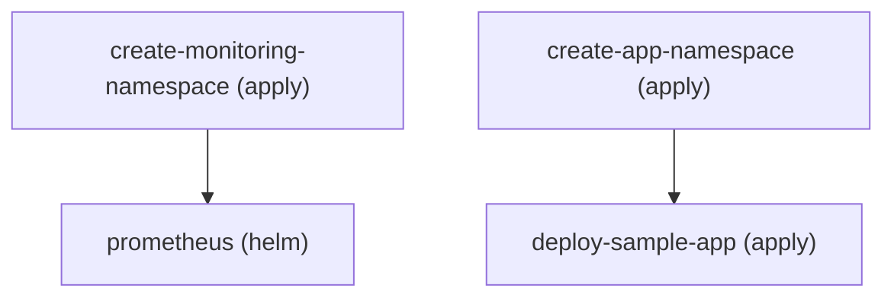

# Examples

All specs live in [`examples/`](https://github.com/dvrkn/khook/tree/main/examples)
and validate against the [DSL specification](dsl.md).

| Spec | Shows |
|---|---|
| [`simple.yaml`](https://github.com/dvrkn/khook/blob/main/examples/simple.yaml) | Create a namespace with `apply:`, install ingress-nginx with `helm:`. The quickstart spec. |
| [`with-variables.yaml`](https://github.com/dvrkn/khook/blob/main/examples/with-variables.yaml) | `${NAME}` / `${NAME:-default}`, sprig pipelines, `KHOOK_VAR_*` / `KHOOK_SECRET_*`, and `when:` conditions. |
| [`multi-app.yaml`](https://github.com/dvrkn/khook/blob/main/examples/multi-app.yaml) | Two independent branches (monitoring stack, sample app) running in parallel. |
| [`helm-depth.yaml`](https://github.com/dvrkn/khook/blob/main/examples/helm-depth.yaml) | Every chart source: `oci://` with ECR auth, private HTTP(S) repos, local paths, values from a URL, uninstall via `delete:`. |
| [`kubectl-depth.yaml`](https://github.com/dvrkn/khook/blob/main/examples/kubectl-depth.yaml) | `apply.waitFor`, jsonpath waits, `patch:` (strategic/merge/json), kustomize sources. |
| [`localenv.yaml`](https://github.com/dvrkn/khook/blob/main/examples/localenv.yaml) | Local k3d/kind environment: optional Cilium, Argo CD at `argocd.localhost`, kube-prometheus-stack with Grafana at `grafana.localhost`. |
| [`real-case.yaml`](https://github.com/dvrkn/khook/blob/main/examples/real-case.yaml) | Reference benchmark: EKS bootstrap with a CNI swap to Cilium, external-secrets, and Argo CD handoff. |
| [`lambda/`](https://github.com/dvrkn/khook/tree/main/examples/lambda) | Invocation contract for the planned Terraform/Lambda integration ([roadmap](https://github.com/dvrkn/khook/blob/main/ROADMAP.md)). |

## Local environment

`localenv.yaml` sets up ingress (k3d's bundled Traefik), Argo CD, and a
monitoring stack on k3d:

```console
$ k3d cluster create localenv -p "80:80@loadbalancer"
$ khook apply -f examples/localenv.yaml
```

Then open `http://argocd.localhost` and `http://grafana.localhost`.
Cilium is off by default because k3d ships a working CNI. To use it, create
the cluster without flannel and pass `--set INSTALL_CILIUM=true`; the spec's
`when:` condition handles the rest.

## Visualize a spec

`khook graph` prints the step DAG as Mermaid (the default, rendered by GitHub
Markdown) or Graphviz DOT (`--format dot`):

```console
$ khook graph -f examples/multi-app.yaml
flowchart TD
    n0["create-monitoring-namespace (apply)"]
    n1["prometheus (helm)"]
    n2["create-app-namespace (apply)"]
    n3["deploy-sample-app (apply)"]
    n0 --> n1
    n2 --> n3
```

Rendered:



Steps excluded by `when:` are drawn dashed and labeled `skipped`, so the graph
matches the run you would get with the same variables.
