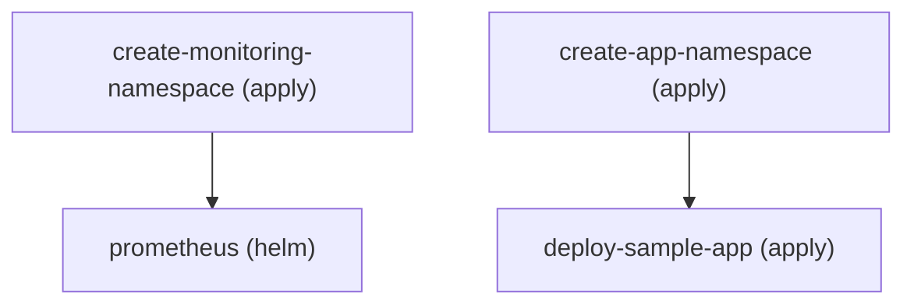

# Examples

Every spec below lives in [`examples/`](https://github.com/dvrkn/khook/tree/main/examples)
and validates against the [DSL specification](dsl.md) — they are the
spec-by-example counterpart to the reference docs.

| Spec | What it shows |
|---|---|
| [`simple.yaml`](https://github.com/dvrkn/khook/blob/main/examples/simple.yaml) | The two-step hello world: create a namespace with `apply:`, install ingress-nginx with `helm:`. The quickstart spec. |
| [`with-variables.yaml`](https://github.com/dvrkn/khook/blob/main/examples/with-variables.yaml) | Variables end-to-end — `${NAME}` / `${NAME:-default}`, sprig pipelines, `KHOOK_VAR_*` / `KHOOK_SECRET_*` sources, and `when:` CEL conditions. |
| [`multi-app.yaml`](https://github.com/dvrkn/khook/blob/main/examples/multi-app.yaml) | Two independent DAG branches (monitoring stack, sample app) that run in parallel levels. |
| [`helm-depth.yaml`](https://github.com/dvrkn/khook/blob/main/examples/helm-depth.yaml) | Every chart-source form: `oci://` references with ECR auth, private HTTP(S) repos, local chart paths, values from a URL, and release uninstall via `delete:`. |
| [`kubectl-depth.yaml`](https://github.com/dvrkn/khook/blob/main/examples/kubectl-depth.yaml) | The kubectl surface: apply+wait in one step (`waitFor`), jsonpath waits, in-place `patch:` (strategic/merge/json), and kustomize manifest sources. |
| [`localenv.yaml`](https://github.com/dvrkn/khook/blob/main/examples/localenv.yaml) | A k3d/kind local dev environment: optional Cilium CNI, Argo CD at `argocd.localhost`, kube-prometheus-stack with Grafana at `grafana.localhost`. |
| [`real-case.yaml`](https://github.com/dvrkn/khook/blob/main/examples/real-case.yaml) | The benchmark: a production-shaped EKS bootstrap — CNI swap to Cilium, external-secrets, ArgoCD handoff. |
| [`lambda/`](https://github.com/dvrkn/khook/tree/main/examples/lambda) | The invocation contract for the planned Terraform/Lambda integration ([roadmap](https://github.com/dvrkn/khook/blob/main/ROADMAP.md)). |

## A local environment in one command

`localenv.yaml` stands up a complete local dev environment on k3d — ingress
via k3d's bundled Traefik, Argo CD, and a monitoring stack:

```console
$ k3d cluster create localenv -p "80:80@loadbalancer"
$ khook apply -f examples/localenv.yaml
```

Then open `http://argocd.localhost` and `http://grafana.localhost`.
Cilium is off by default (k3d ships a working CNI); create the cluster
without flannel and add `--set INSTALL_CILIUM=true` to swap it in — the
spec's `when:` condition takes care of the rest.

## Visualize any spec

`khook graph` emits the step DAG for review — Mermaid by default (renders
directly in GitHub Markdown), Graphviz DOT with `--format dot`:

```console
$ khook graph -f examples/multi-app.yaml
flowchart TD
    n0["create-monitoring-namespace (apply)"]
    n1["prometheus (helm)"]
    n2["create-app-namespace (apply)"]
    n3["deploy-sample-app (apply)"]
    n0 --> n1
    n2 --> n3
```

Rendered, that output is the execution plan at a glance — the two branches
run in parallel:



Steps excluded by a `when:` condition are drawn dashed and labeled `skipped`,
so the graph reflects the run you'd actually get with those variables.
